 # WHS NHS Hours Log — User Guide

A complete, screenshot-by-screenshot tour of the chapter's volunteer-hours tracking
app. Every screenshot below was taken from the running app using the demo accounts.

- **Members** sign up by invite, browse and sign up for volunteer events, self-report
  hours, request new events, and track their progress toward the yearly goal.
- **Officers** create and run events, approve hours and event requests, manage the
  roster, send invites, and configure the chapter — all from a dedicated Officer Panel.

> **Demo accounts** (local seed data)
> - Officer — `officer@demo.local` / `OfficerDemo1!`
> - Member — `member1@demo.local` / `MemberDemo1!`

---

## Contents

- [Public & account pages](#public--account-pages)
  - [Landing page](#landing-page)
  - [Log in](#log-in)
  - [Sign up (invite-only)](#sign-up-invite-only)
  - [Forgot password](#forgot-password)
- [Member experience](#member-experience)
  - [Dashboard](#member-dashboard)
  - [Volunteer events](#volunteer-events)
  - [Hours history](#hours-history)
  - [Report hours](#report-hours)
  - [Request an event](#request-an-event)
  - [Settings](#settings)
- [Officer experience](#officer-experience)
  - [Dashboard (member progress)](#officer-dashboard--member-progress)
  - [Events](#events)
  - [Take attendance](#take-attendance)
  - [Edit event](#edit-event)
  - [Requests & hour reports](#requests--hour-reports)
  - [Member roster](#member-roster)
  - [Member detail](#member-detail)
  - [Invite links](#invite-links)
  - [Admin hub](#admin-hub)
  - [Chapter settings](#chapter-settings)
  - [Integrations](#integrations)
  - [Audit log](#audit-log)
  - [Year-end reset](#year-end-reset)
- [Email notifications](#email-notifications)

---

## Public & account pages

### Landing page

`/` — the public front door. Members and officers both arrive here. It explains the
app and offers two paths: **Log in** for existing accounts and **Sign up** for people
who already hold an invite link. Sign-up is invite-only, so there's no open
registration.

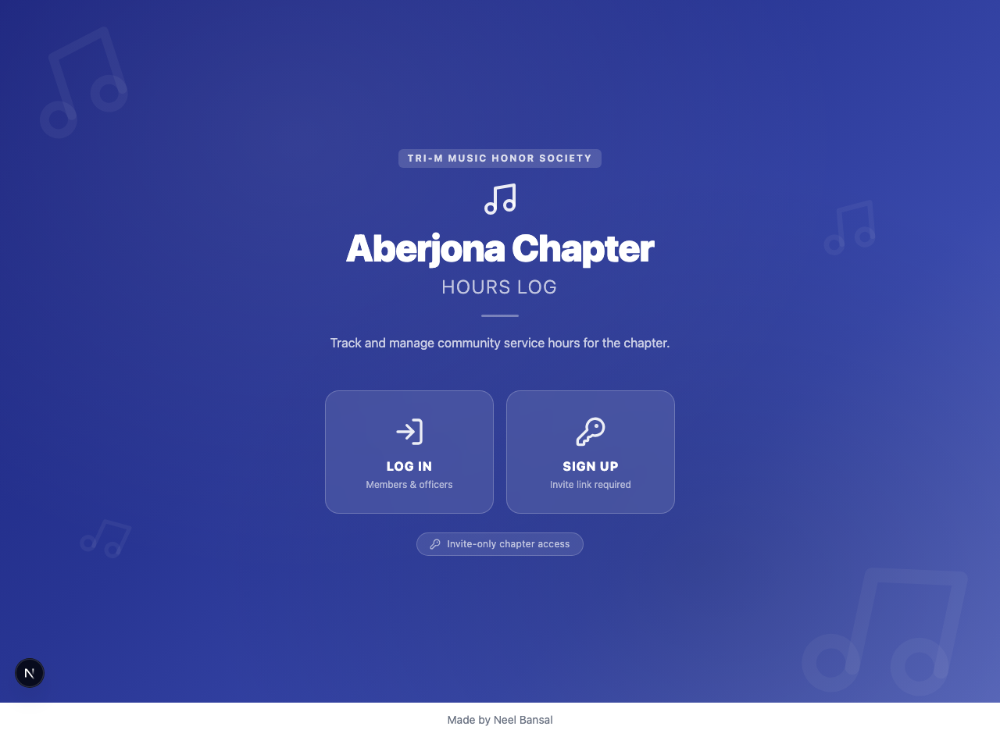

### Log in

`/login` — email + password sign-in for any account (member or officer). Links out to
**Forgot password** and to **Sign up** for invited users. On success the app routes
members to their dashboard and officers to the Officer Panel. If an account hasn't
verified its email yet, the page prompts to resend the verification link.

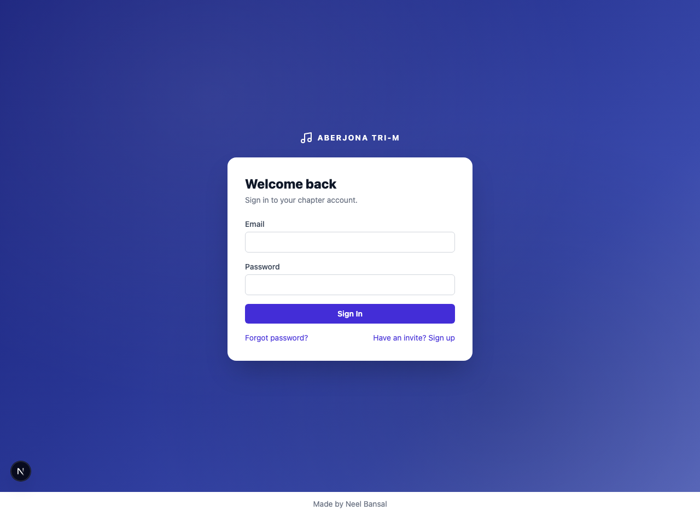

### Sign up (invite-only)

`/signup?invite=…` — only reachable with a valid invite link generated by an officer.
A new member fills in name, email, optional graduation year, and a password. On submit
the account is created and a verification email is sent; the account activates once the
member clicks the link. Opening `/signup` without a valid invite shows an
"invite required" message instead of this form.

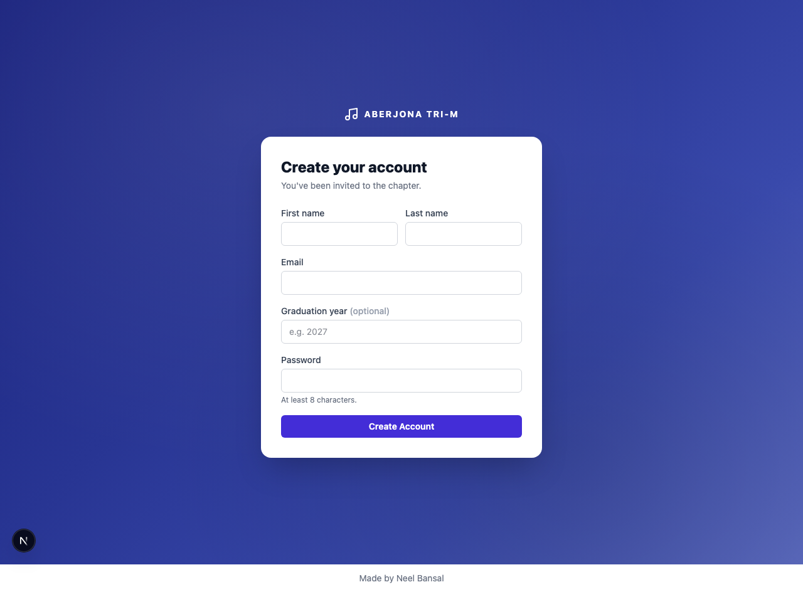

### Forgot password

`/forgot-password` — enter your email to receive a reset link (valid for one hour). To
avoid leaking which emails exist, the confirmation message is the same whether or not
the address is registered. The link opens a reset-password page where you set a new
password.

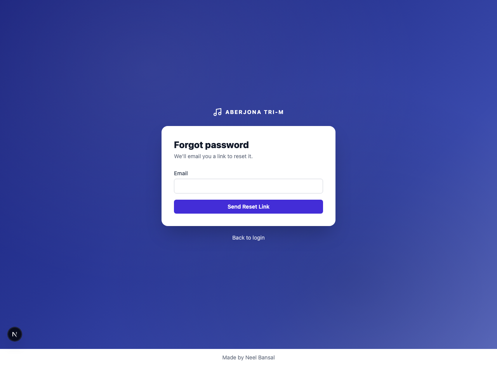

---

## Member experience

Members navigate with the top bar (Dashboard · Events · Report Hours · Request Event)
on desktop; on phones the same destinations appear as a bottom navigation bar. The
account block (name · Settings · Log out) sits at the top right.

### Member dashboard

`/member/dashboard` — the member's home. The top card shows **service hours earned vs
the yearly goal** with a color-coded progress bar (yellow under 70%, green at/above
70%) and a count of how many hours are still needed, plus a note if any self-reported
hours are awaiting officer approval. Below it: **upcoming timeslots** the member is
signed up for, and the status of any **event requests** they've submitted (with a
Cancel option while pending).

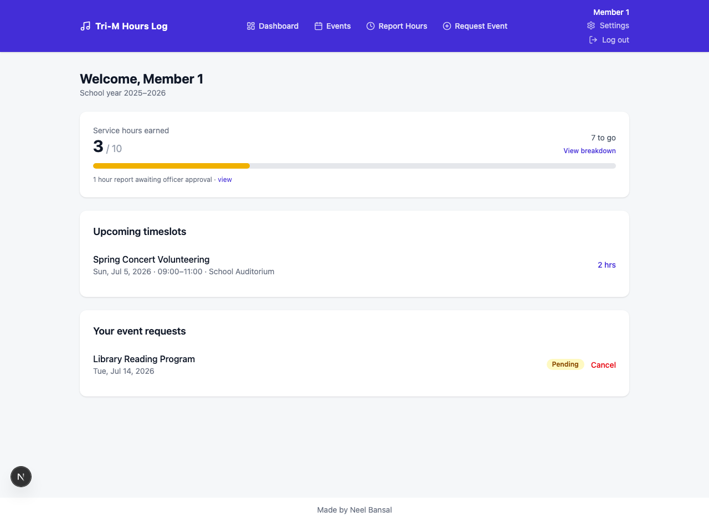

### Volunteer events

`/member/events` — every active event open for sign-ups. Each event lists its
timeslots with date, time, hours value, and how many spots are filled (e.g. `1/4
filled`). Members **Sign up** for a slot, or **Withdraw** from one they've joined. When
a slot is full, joining adds the member to a FIFO **waitlist**; if someone withdraws,
the next person is automatically promoted and emailed.

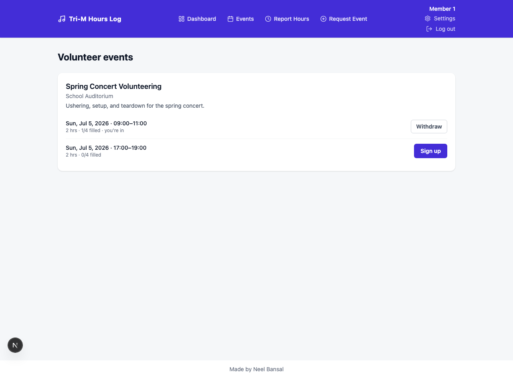

### Hours history

`/member/history` — an itemized ledger of everything counted toward the yearly total:
attended events, approved self-reported hours, and any officer adjustments — each with
date, activity, type, and hours. The header shows the running `X of Y hours` for the
current school year (Sept 1 – Aug 31).

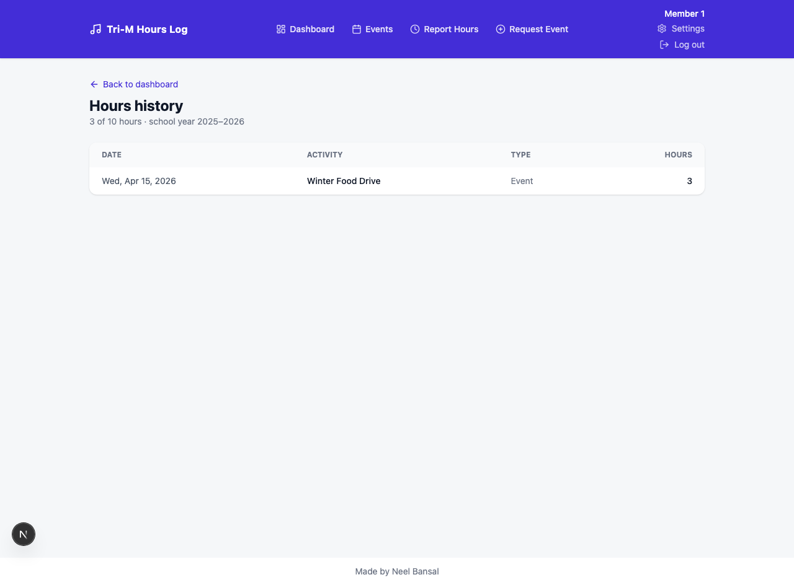

### Report hours

`/member/report-hours` — for service done outside an official chapter event. The member
describes the activity, picks a date, enters hours, and adds optional notes. Each
submission is **pending until an officer approves it**, and only then counts toward the
total. The lower card lists the member's past reports with their status.

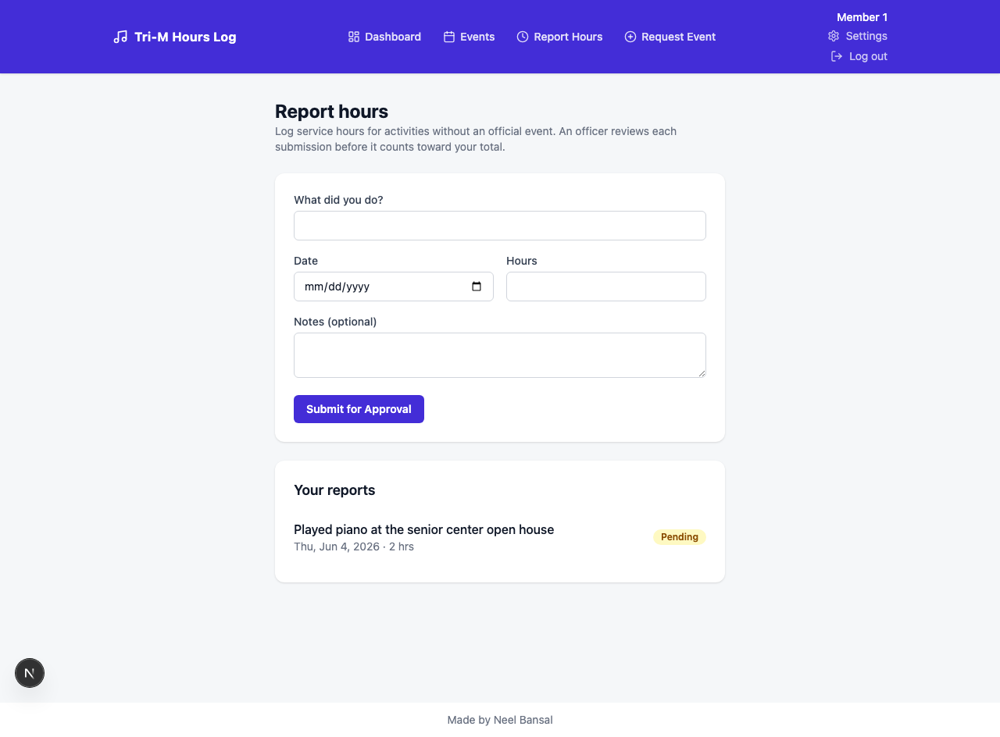

### Request an event

`/member/request-event` — members can propose a new volunteer opportunity (title,
location, description, and one or more timeslots with the volunteers needed). The
request goes to officers for review; if approved it becomes a real event and the
chapter is notified.

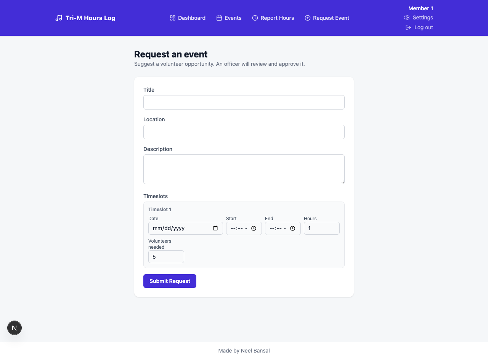

### Settings

`/settings` — available to both members and officers. Sections:
- **Profile** — update name and graduation year.
- **Change password** — requires the current password; no email step while signed in.
- **Change email** — requires the current password, then sends a verification link to
  the new address; the change only takes effect once that link is clicked.
- **Sessions** — shows active sessions and a **Sign out everywhere** button that
  revokes every device (sessions are tracked server-side, so this is immediate).

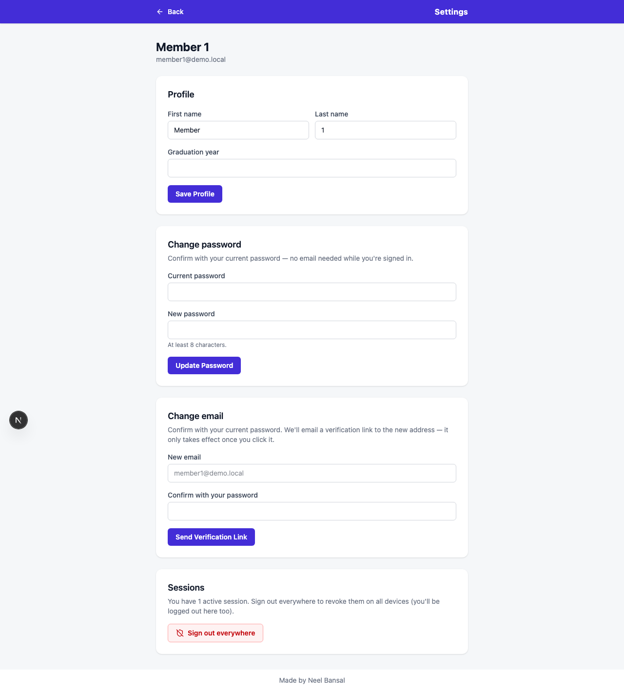

---

## Officer experience

Officers get a dedicated **Officer Panel** with a left sidebar (Dashboard · Events ·
Requests · Members · Invites · Admin) on desktop, collapsing to a bottom bar on phones.
The footer of the sidebar has Settings and Log out.

### Officer dashboard — member progress

`/officer/dashboard` — the officer home. A table of every member with their
progress bar, hours earned, and hours remaining, plus a one-line summary (how many
members are still working toward the goal). The **Email hours reminder** button sends
every active member a personalized hours-summary email — a nudge for those short of the
goal and a congratulations for those who've met it. **Admin** opens the configuration
hub.

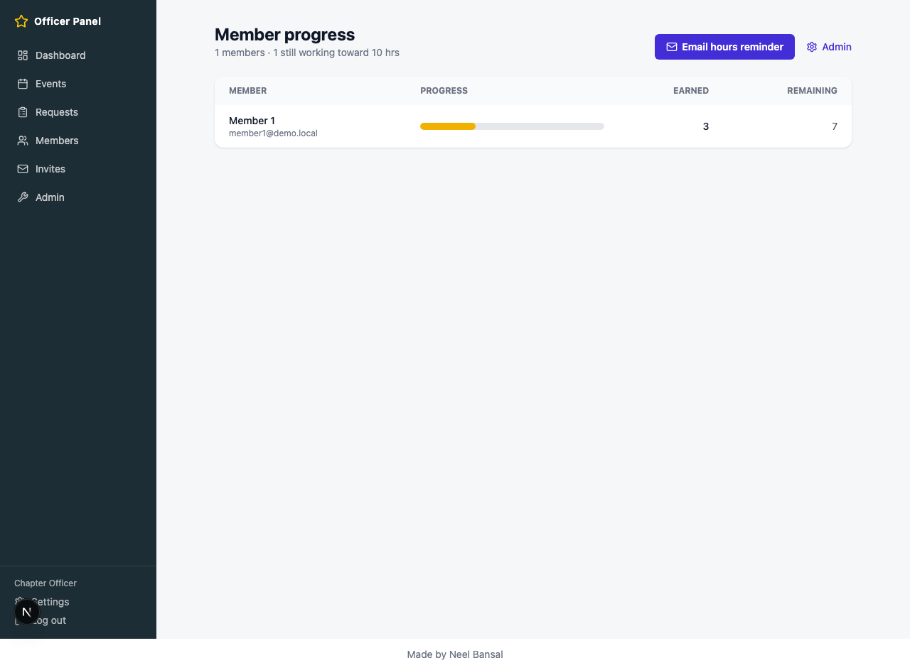

### Events

`/officer/events` — create and manage events. The **Create event** form takes a title,
location, description, and one or more **timeslots** (date, start/end time, hours value,
and volunteers needed per slot — you can add multiple slots). The **All events** table
lists everything with its timeslots and status (**Pending** request, **Active**, or
**Completed**) and quick actions to **Take attendance** or **Edit**.

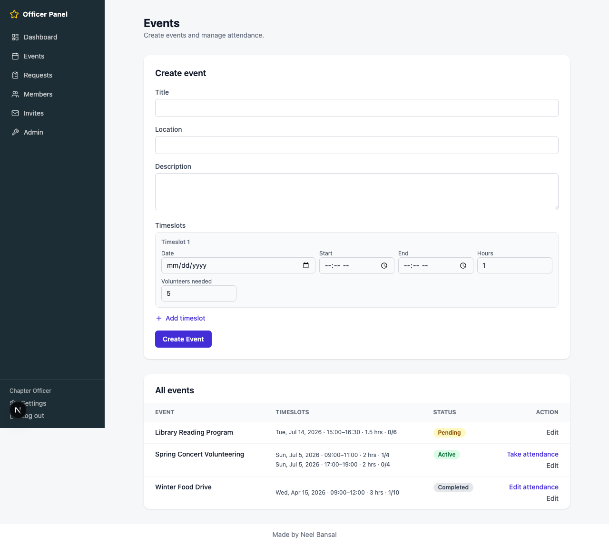

### Take attendance

`/officer/events/[id]/attendance` — per-timeslot attendance. Only confirmed volunteers
are listed; check off who actually showed up and **Update attendance** to credit their
hours (credited members get an email). An event is marked **Completed** once every slot
has been recorded.

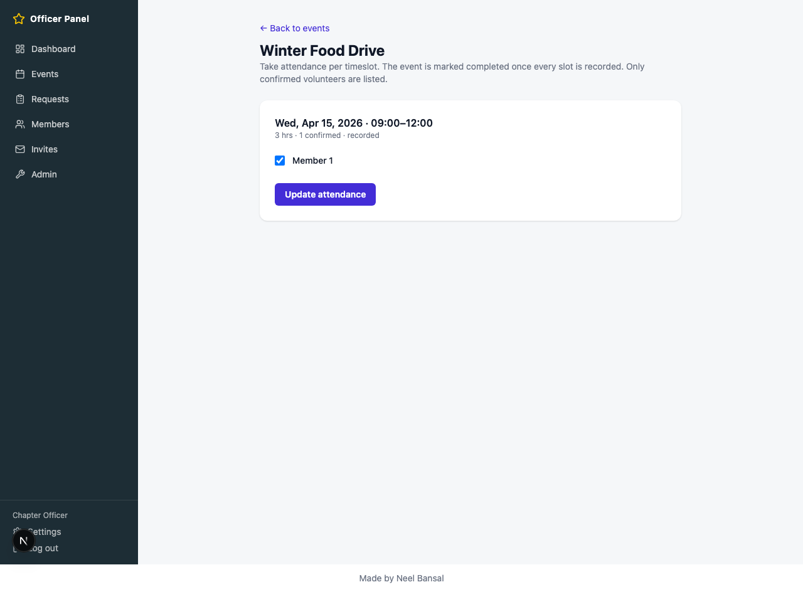

### Edit event

`/officer/events/[id]/edit` — change the title, location, description, and timeslots of
an existing event. You can add or remove timeslots (removal warns when volunteers are
already signed up). The bottom row has two destructive actions: **Cancel event**
(notifies signed-up members it's off) and **Delete event** (removes it entirely).

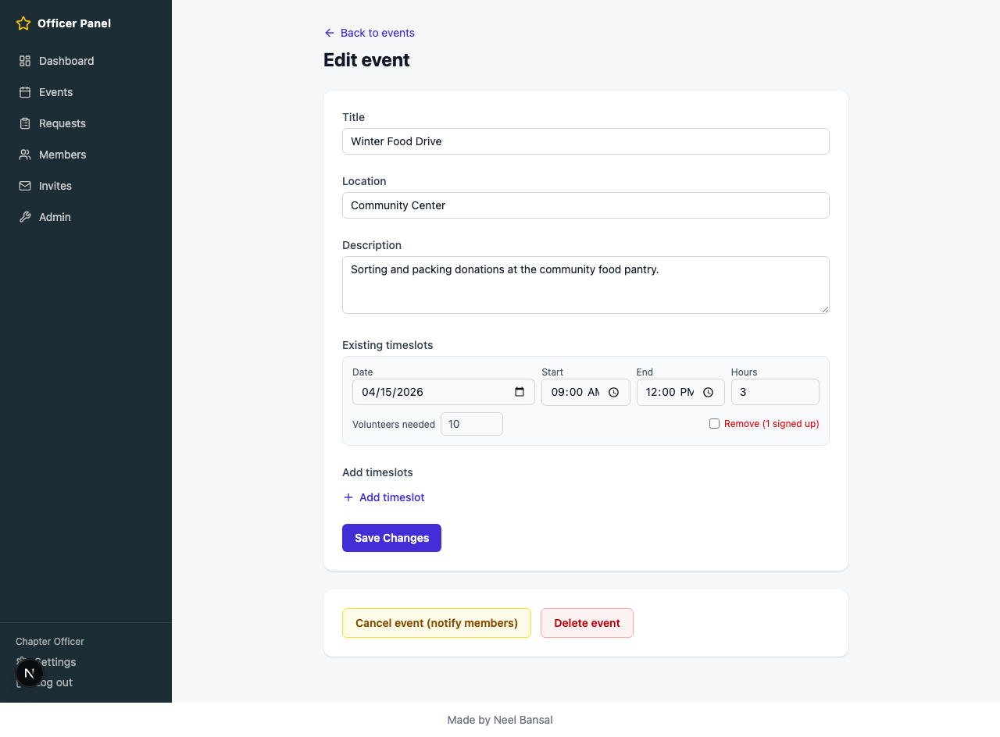

### Requests & hour reports

`/officer/requests` — the officer review queue, in two sections:
- **Event requests** — member-proposed events; **Approve** publishes the event and
  notifies the chapter, **Deny** rejects it.
- **Hour reports** — member-submitted hours for non-event service; **Approve** credits
  the hours, **Deny** rejects. Either decision emails the member.

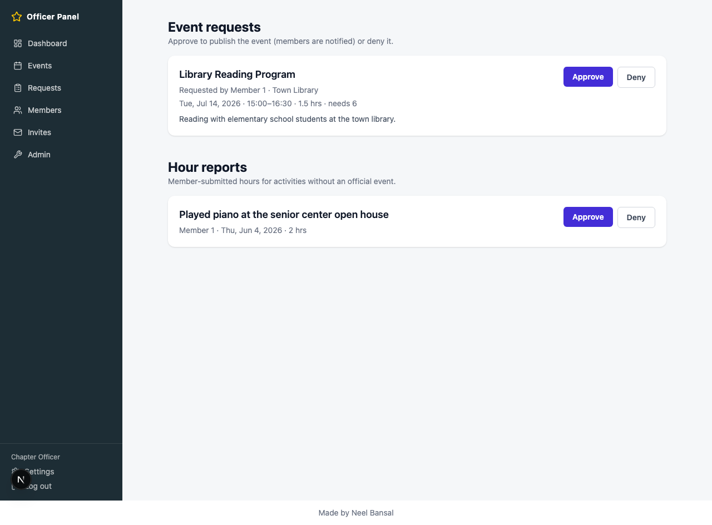

### Member roster

`/officer/members` — the full roster with name, email, graduation class, hours earned,
and verification status. **Export CSV** downloads the roster for record-keeping. Click a
member to open their detail page.

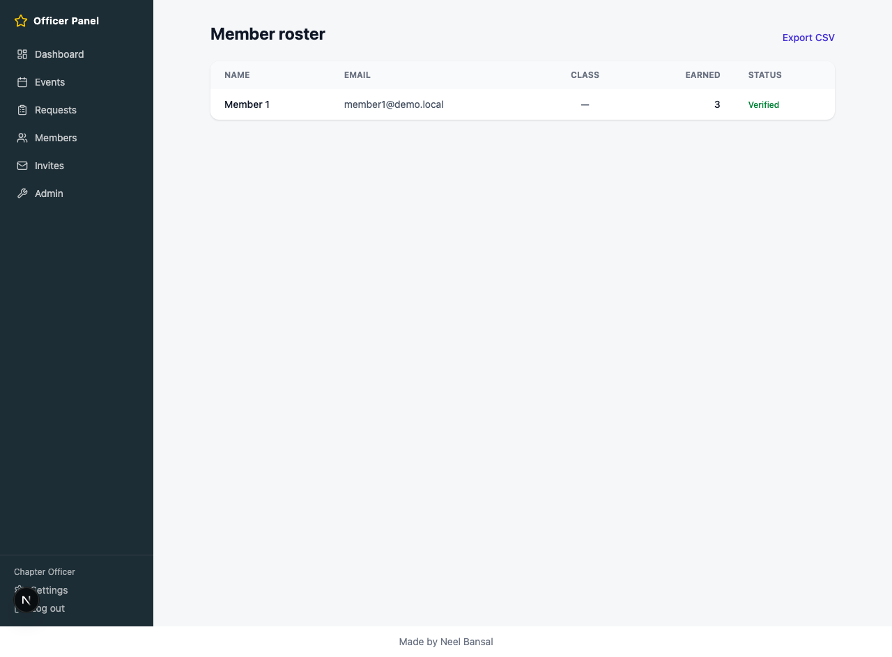

### Member detail

`/officer/members/[id]` — a single member's record. Shows their hours-earned progress,
an **Adjust hours** form to add a correction (positive or negative, with a reason and
date), an itemized **Hours breakdown**, and **Manage** actions to **Promote to officer**
or **Deactivate** the account.

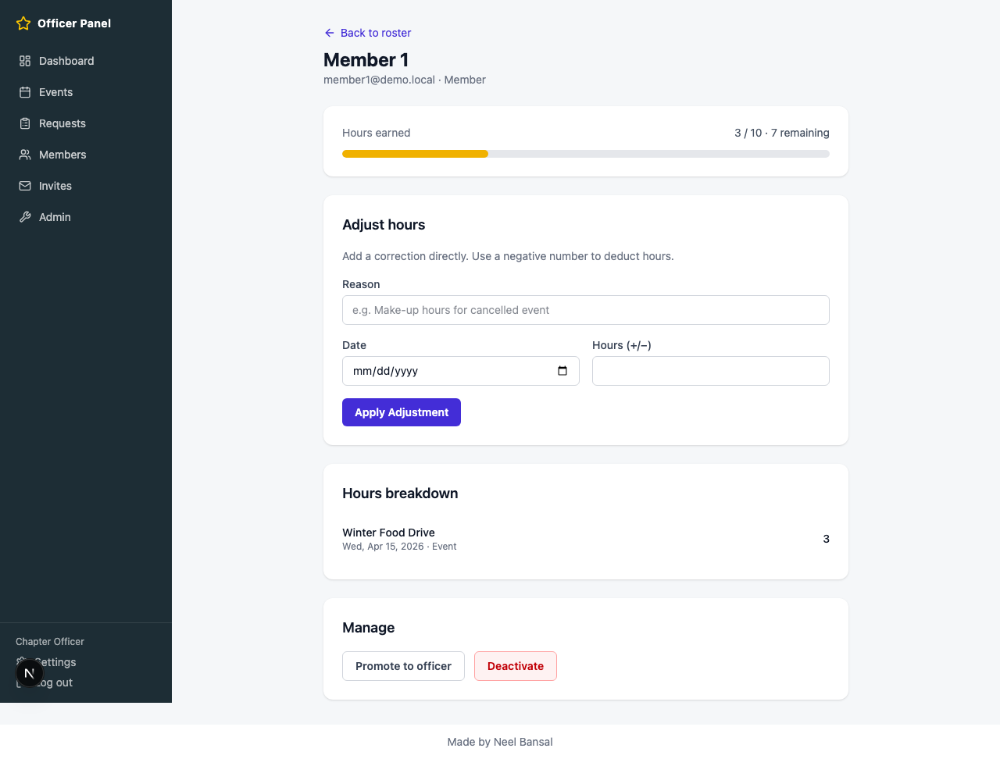

### Invite links

`/officer/invites` — generate invite links for new members. Choose an expiry, an
optional max-use count, and the role granted, and optionally email the link directly.
**Active invites** lists outstanding links with their creator, role, expiry, and usage
count, each revocable.

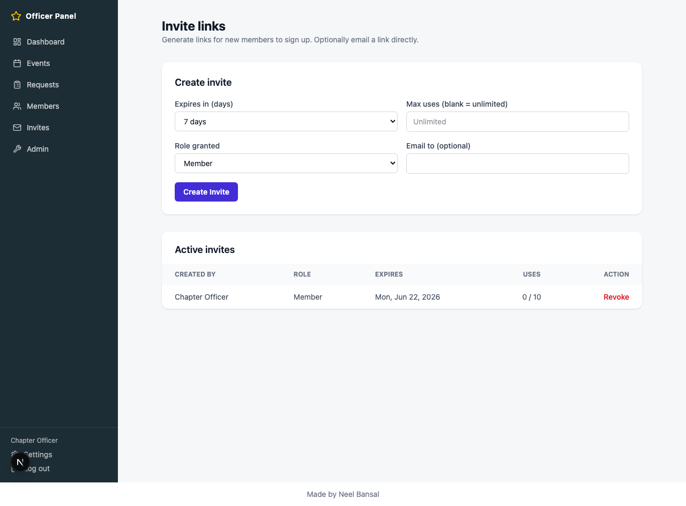

### Admin hub

`/officer/admin` — the configuration hub linking the four officer-only admin tools:
**Chapter settings**, **Integrations**, **Audit log**, and **Year-end reset**. Keeping
these on a separate hub keeps the main navigation uncluttered.

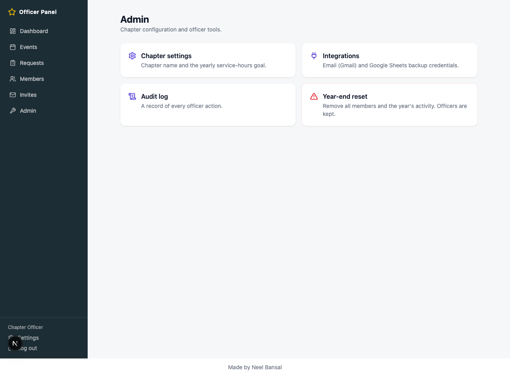

### Chapter settings

`/officer/chapter` — the **chapter name** and the **yearly service-hours goal**. The
goal drives every member's progress bar and "hours remaining" math (bars turn yellow at
30% and green at 70% of the goal).

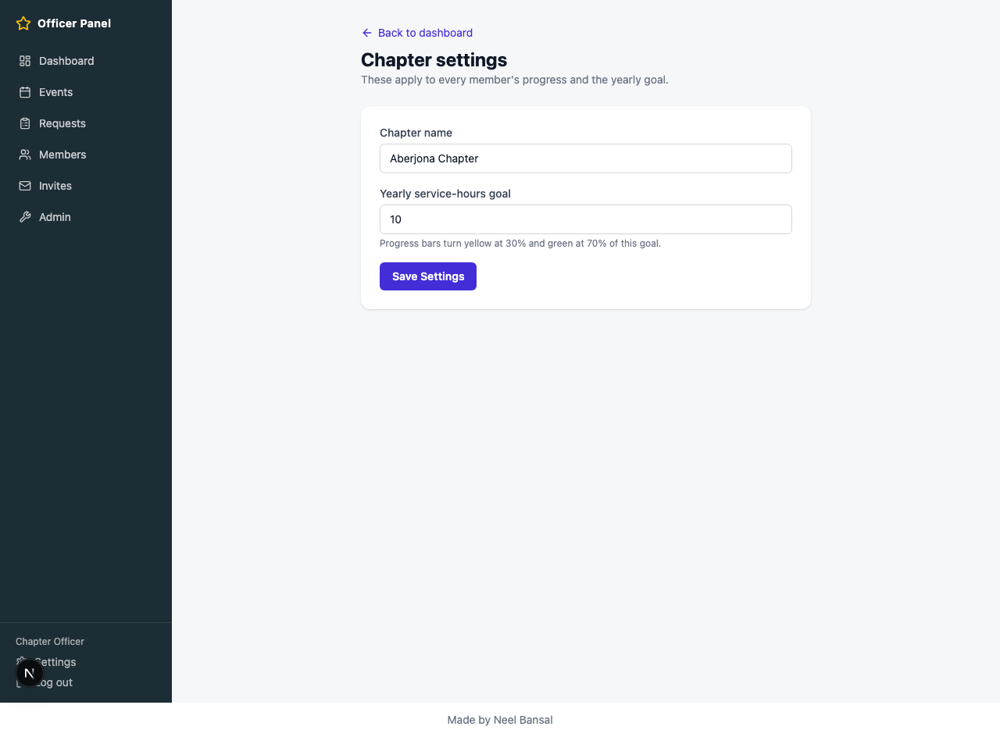

### Integrations

`/officer/integrations` — connect outbound email and the Sheets backup, editable from
the UI (no redeploy needed). **Email (Gmail)** takes a Gmail address and app password;
**Google Sheets backup** takes a spreadsheet ID, service-account email, and private key.
Secrets are **encrypted at rest and never shown again** (each section shows only a
"set / not set" badge), and **saving requires the officer's password**.

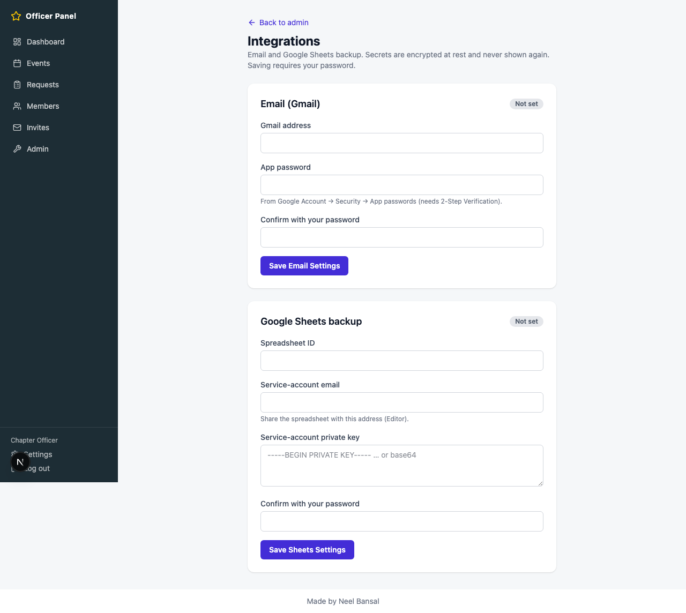

### Audit log

`/officer/audit` — a reverse-chronological record of every officer action (when, which
officer, the action type, and a human-readable summary). Covers event create/edit/
cancel, attendance, approvals, roster changes, invites, settings, and reset. The log is
retained even through a year-end reset.

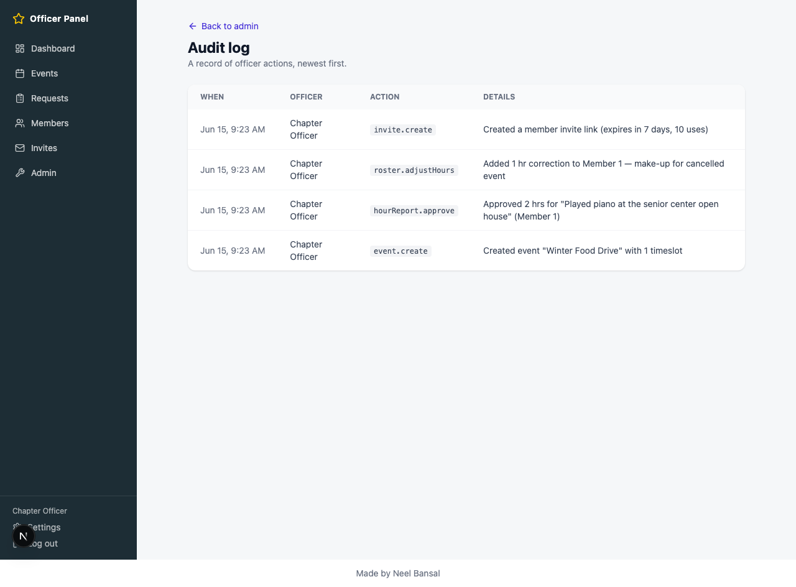

### Year-end reset

`/officer/reset` — at year's turnover, safely clear out the outgoing members and the
year's activity while **keeping officers**, chapter settings, integrations, and the
audit log. Because it's irreversible, it's guarded by a **triple gate**: type the exact
dynamic phrase `RESET <N> MEMBERS` (N is the live member count), re-enter your password,
and tick the "I understand" checkbox. The count is re-checked server-side, and the page
recommends backing up the database file first.

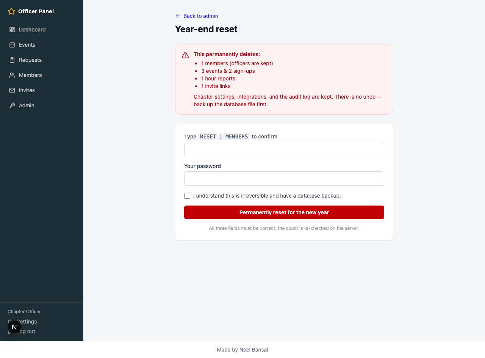

---

## Email notifications

The app emails people at the moments that matter (all sends are no-ops until a Gmail
account is configured under **Integrations**):

| Trigger | Recipient |
| --- | --- |
| Account invited / email verification / email change / password reset | The affected user |
| New event posted | All active members |
| Event request approved or denied | The requesting member |
| New event request submitted | Officers |
| Hours credited from attendance | The credited member |
| Hour report approved or denied | The reporting member |
| Waitlist spot opens up | The promoted member |
| Event cancelled | Members who were signed up |
| **Hours reminder** (officer button) | Every active member, personalized |

---

*Screenshots generated from the running app with the demo seed data. They're committed
as static PNGs, so no extra dependency is needed to read this guide. To re-generate
them: start the dev server, then (Playwright is intentionally **not** a project
dependency) run it ad-hoc —
`npx playwright install chromium && node docs/user-guide/screenshots.mjs <invite-token>`.*
